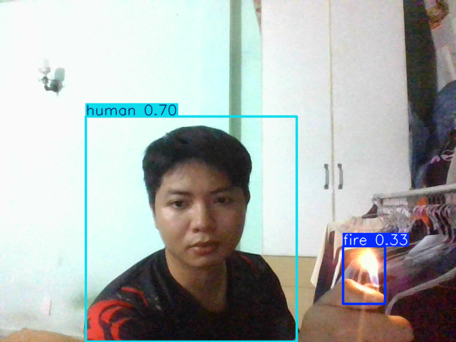

# AI-Camera-Fire-Smoke-Human-Detection
Individual

## 🔥 Fire, Smoke, and Human Detection using YOLOv8  

This project focuses on detecting **fire, smoke, and humans** in real-time using the **YOLOv8** object detection model.  
The system is designed to provide **early fire warnings** and improve **safety monitoring** in environments such as factories or public areas.  

## Key Features
- Detects **fire, smoke, and people** simultaneously.  
- Supports **real-time inference** on camera streams.  
- Trained using a high-quality dataset from Roboflow.  
- Can be deployed on **Raspberry Pi**, **Jetson Nano**, or other edge devices.  

## Dataset
Dataset: [Fire, Smoke, and Human Detector (Roboflow)](https://universe.roboflow.com/spyrobot/fire-smoke-and-human-detector)

## ⚙️ Model Training
- Framework: **Ultralytics YOLOv8**
- Input size: `640x640`
- Dataset split: Train / Valid / Test
- Classes: `fire`, `smoke`, `human`

## 📸 Detection Results  

Below is an example of the detection result after training the model:  

  

## 📧 Support
For support or collaboration, please contact: **lichpham1125@gmail.com**
